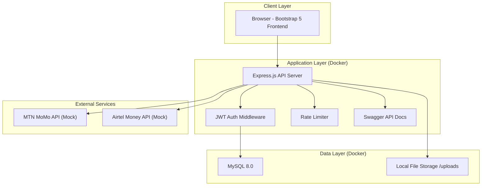

# FitTrack Rwanda — Implementation Plan

A production-ready full-stack fitness e-commerce and tracking platform for the Rwandan market, built with Node.js/Express, MySQL, and Bootstrap 5.

---

## Architecture Overview



---

## Project Structure

```
fittrack-rwanda/
├── docker-compose.yml
├── Dockerfile
├── .env.example
├── .gitignore
├── README.md
├── package.json
│
├── src/
│   ├── server.js                    # Entry point
│   ├── app.js                       # Express app setup
│   ├── config/
│   │   ├── database.js              # MySQL connection pool
│   │   ├── jwt.js                   # JWT configuration
│   │   └── swagger.js               # Swagger/OpenAPI config
│   │
│   ├── database/
│   │   ├── migrate.js               # Migration runner
│   │   └── migrations/
│   │       └── 001_initial_schema.sql
│   │
│   ├── middleware/
│   │   ├── auth.js                  # JWT verification
│   │   ├── admin.js                 # Admin role check
│   │   ├── rateLimiter.js           # Rate limiting
│   │   ├── validator.js             # Input validation
│   │   ├── errorHandler.js          # Centralized error handler
│   │   └── upload.js                # Multer file upload
│   │
│   ├── routes/
│   │   ├── auth.routes.js
│   │   ├── product.routes.js
│   │   ├── category.routes.js
│   │   ├── cart.routes.js
│   │   ├── order.routes.js
│   │   ├── payment.routes.js
│   │   ├── subscription.routes.js
│   │   ├── fitness.routes.js
│   │   └── admin.routes.js
│   │
│   ├── controllers/
│   │   ├── auth.controller.js
│   │   ├── product.controller.js
│   │   ├── category.controller.js
│   │   ├── cart.controller.js
│   │   ├── order.controller.js
│   │   ├── payment.controller.js
│   │   ├── subscription.controller.js
│   │   ├── fitness.controller.js
│   │   └── admin.controller.js
│   │
│   ├── services/
│   │   ├── auth.service.js
│   │   ├── product.service.js
│   │   ├── cart.service.js
│   │   ├── order.service.js
│   │   ├── payment.service.js        # Mock MoMo/Airtel gateway
│   │   ├── subscription.service.js
│   │   └── fitness.service.js
│   │
│   └── utils/
│       ├── helpers.js
│       ├── constants.js
│       └── logger.js
│
├── public/                          # Static frontend files
│   ├── index.html                   # Home page
│   ├── products.html
│   ├── product-detail.html
│   ├── subscriptions.html
│   ├── about.html
│   ├── contact.html
│   ├── login.html
│   ├── register.html
│   ├── profile.html
│   ├── cart.html
│   ├── checkout.html
│   ├── orders.html
│   ├── fitness-dashboard.html
│   ├── subscription-manage.html
│   ├── admin/
│   │   ├── dashboard.html
│   │   ├── products.html
│   │   ├── orders.html
│   │   ├── users.html
│   │   └── reports.html
│   ├── css/
│   │   ├── style.css                # Global styles & design system
│   │   ├── admin.css                # Admin-specific styles
│   │   └── components.css           # Reusable component styles
│   ├── js/
│   │   ├── api.js                   # API client wrapper
│   │   ├── auth.js                  # Auth state management
│   │   ├── app.js                   # Home page logic
│   │   ├── products.js
│   │   ├── product-detail.js
│   │   ├── cart.js
│   │   ├── checkout.js
│   │   ├── orders.js
│   │   ├── fitness.js               # Charts via Chart.js
│   │   ├── subscriptions.js
│   │   ├── profile.js
│   │   └── admin/
│   │       ├── dashboard.js
│   │       ├── products.js
│   │       ├── orders.js
│   │       ├── users.js
│   │       └── reports.js
│   └── img/                         # Static images
│
├── uploads/                         # User-uploaded product images
│
├── tests/
│   ├── unit/
│   │   ├── auth.service.test.js
│   │   ├── cart.service.test.js
│   │   └── payment.service.test.js
│   ├── integration/
│   │   ├── auth.test.js
│   │   ├── product.test.js
│   │   ├── cart.test.js
│   │   └── order.test.js
│   └── setup.js
│
└── .github/
    └── workflows/
        └── ci-cd.yml
```

---

## Database Design (ERD)

```mermaid
erDiagram
    USERS {
        int user_id PK
        varchar full_name
        varchar email UK
        varchar password_hash
        varchar phone
        varchar address
        enum role "admin,user"
        varchar avatar_url
        datetime created_at
        datetime updated_at
    }

    CATEGORIES {
        int category_id PK
        varchar name UK
        varchar description
        varchar image_url
        datetime created_at
    }

    PRODUCTS {
        int product_id PK
        varchar name
        text description
        decimal price
        int stock_quantity
        varchar image_url
        int category_id FK
        boolean is_active
        datetime created_at
        datetime updated_at
    }

    ORDERS {
        int order_id PK
        int user_id FK
        varchar order_reference UK
        varchar full_name
        varchar email
        varchar phone
        text delivery_address
        decimal subtotal
        decimal delivery_fee
        decimal grand_total
        enum status "pending,confirmed,processing,shipped,delivered,cancelled"
        datetime created_at
        datetime updated_at
    }

    ORDER_ITEMS {
        int item_id PK
        int order_id FK
        int product_id FK
        int quantity
        decimal unit_price
        decimal total_price
    }

    CARTS {
        int cart_id PK
        int user_id FK UK
        datetime created_at
        datetime updated_at
    }

    CART_ITEMS {
        int cart_item_id PK
        int cart_id FK
        int product_id FK
        int quantity
        datetime added_at
    }

    SUBSCRIPTIONS {
        int subscription_id PK
        int user_id FK
        enum plan_type "basic,premium,annual"
        decimal price
        enum status "active,expired,cancelled"
        date start_date
        date end_date
        datetime created_at
        datetime updated_at
    }

    FITNESS_PROGRESS {
        int progress_id PK
        int user_id FK
        decimal weight_kg
        decimal height_cm
        decimal body_fat_pct
        decimal chest_cm
        decimal waist_cm
        decimal hips_cm
        decimal biceps_cm
        varchar workout_type
        int duration_minutes
        int calories_burned
        text notes
        date recorded_date
        datetime created_at
    }

    FITNESS_GOALS {
        int goal_id PK
        int user_id FK
        varchar goal_type
        decimal target_value
        decimal current_value
        varchar unit
        date deadline
        enum status "in_progress,completed,abandoned"
        datetime created_at
        datetime updated_at
    }

    PAYMENTS {
        int payment_id PK
        int user_id FK
        int order_id FK "nullable"
        int subscription_id FK "nullable"
        enum payment_method "mtn_momo,airtel_money,cash_on_delivery"
        varchar phone_number
        decimal amount
        varchar transaction_reference UK
        enum payment_status "pending,completed,failed,refunded"
        datetime payment_date
        datetime created_at
    }

    USERS ||--o{ ORDERS : places
    USERS ||--o| CARTS : has
    USERS ||--o{ SUBSCRIPTIONS : subscribes
    USERS ||--o{ FITNESS_PROGRESS : records
    USERS ||--o{ FITNESS_GOALS : sets
    USERS ||--o{ PAYMENTS : makes
    CATEGORIES ||--o{ PRODUCTS : contains
    ORDERS ||--o{ ORDER_ITEMS : contains
    ORDERS ||--o{ PAYMENTS : "paid via"
    PRODUCTS ||--o{ ORDER_ITEMS : "ordered in"
    PRODUCTS ||--o{ CART_ITEMS : "added to"
    CARTS ||--o{ CART_ITEMS : contains
    SUBSCRIPTIONS ||--o{ PAYMENTS : "paid via"
```

---

## Proposed Changes — Build Order

The project will be built incrementally in **6 phases**. Each phase is self-contained and testable.

---

### Phase 1 — Foundation & Infrastructure

Sets up the project skeleton, Docker, database, config, and middleware.

#### [NEW] `package.json`
- Node.js project with all dependencies (express, mysql2, bcryptjs, jsonwebtoken, multer, express-validator, helmet, cors, express-rate-limit, swagger-jsdoc, swagger-ui-express, dotenv, morgan, chart.js CDN on frontend)

#### [NEW] `Dockerfile`
- Multi-stage Node.js 20 Alpine image, copies app, exposes port 3000

#### [NEW] `docker-compose.yml`
- App service + MySQL 8.0 service with volume persistence, health checks, environment variables

#### [NEW] `.env.example`
- All required environment variables documented

#### [NEW] `.gitignore`
- Standard Node.js + uploads + env ignores

#### [NEW] `src/server.js` & `src/app.js`
- Express server with all middleware (helmet, cors, rate limiting, morgan, swagger)

#### [NEW] `src/config/database.js`
- MySQL2 connection pool with promise wrapper

#### [NEW] `src/config/jwt.js` & `src/config/swagger.js`

#### [NEW] `src/database/migrations/001_initial_schema.sql`
- Complete schema for all 10 tables with indexes and foreign keys

#### [NEW] `src/database/migrate.js`
- Auto-migration runner that executes on app startup

#### [NEW] All middleware files
- `auth.js`, `admin.js`, `rateLimiter.js`, `validator.js`, `errorHandler.js`, `upload.js`

#### [NEW] `src/utils/helpers.js`, `constants.js`, `logger.js`

---

### Phase 2 — Authentication Module

#### [NEW] `src/routes/auth.routes.js`
- POST `/api/auth/register`, `/api/auth/login`, `/api/auth/logout`
- PUT `/api/auth/profile`, POST `/api/auth/reset-password`

#### [NEW] `src/controllers/auth.controller.js`
#### [NEW] `src/services/auth.service.js`

#### [NEW] Frontend auth pages
- `public/login.html`, `public/register.html`, `public/profile.html`
- `public/js/auth.js`, `public/js/api.js` (API client)

---

### Phase 3 — E-Commerce (Products, Cart, Checkout, Orders)

#### [NEW] Product routes, controller, service
- CRUD for products and categories (admin), listing/search/filter (public)

#### [NEW] Cart routes, controller, service
- Add/remove/update cart items, get cart summary

#### [NEW] Order routes, controller, service
- Create order from cart, order history, order detail

#### [NEW] Category routes, controller

#### [NEW] Frontend pages
- `products.html`, `product-detail.html`, `cart.html`, `checkout.html`, `orders.html`
- Corresponding JS files

---

### Phase 4 — Payment & Subscription Modules

#### [NEW] Payment routes, controller, service
- Mock MTN MoMo and Airtel Money gateways with realistic async flow
- Payment status webhook simulation
- Strategy pattern for easy real API swap

#### [NEW] Subscription routes, controller, service
- Subscribe, renew, cancel, history

#### [NEW] Frontend pages
- `subscriptions.html`, `subscription-manage.html`
- Payment flow integrated into checkout

---

### Phase 5 — Fitness Tracking Module

#### [NEW] Fitness routes, controller, service
- Record progress, set goals, get charts data, monthly reports

#### [NEW] `public/fitness-dashboard.html` & `public/js/fitness.js`
- Chart.js for weight trends, goal progress bars, workout history cards
- Statistics summary cards

---

### Phase 6 — Admin Dashboard, Homepage, & Polish

#### [NEW] Admin routes, controller
- Product CRUD, order management, user management, reports

#### [NEW] Admin frontend pages
- `admin/dashboard.html`, `admin/products.html`, `admin/orders.html`, `admin/users.html`, `admin/reports.html`

#### [NEW] `public/index.html` — Homepage
- Hero banner, featured products, categories, subscription plans, testimonials, contact, footer

#### [NEW] `public/about.html`, `public/contact.html`

#### [NEW] `public/css/style.css`, `components.css`, `admin.css`
- Full design system with Rwandan-inspired color palette, glassmorphism cards, micro-animations

#### [NEW] Tests
- Unit tests for services, integration tests for API endpoints

#### [NEW] `.github/workflows/ci-cd.yml`
- GitHub Actions pipeline for CI/CD

#### [NEW] `README.md`
- Complete setup, usage, and API documentation

---

## Key Architectural Decisions

| Decision | Rationale |
|---|---|
| **Server-rendered static HTML + JS** | Simpler deployment, no build step, aligns with Bootstrap 5 approach, serves from Express static middleware |
| **MySQL2 with raw SQL** | Full control over queries, no ORM overhead, explicit schema via migration files |
| **Service layer pattern** | Controllers stay thin, business logic is testable and reusable |
| **Payment Strategy pattern** | Mock gateways implement same interface as real APIs — swap by changing config |
| **JWT in httpOnly cookies** | More secure than localStorage, prevents XSS token theft |
| **Chart.js via CDN** | Lightweight charting for fitness dashboard, no build tooling needed |
| **Docker-first** | Consistent dev/prod environment, MySQL included — no local install needed |
| **Migration-based schema** | Versioned, repeatable database setup |

---

## Design System (Rwandan-Inspired)

| Token | Value | Usage |
|---|---|---|
| `--primary` | `#0066FF` | CTAs, links, active states |
| `--primary-dark` | `#0047B3` | Hover states |
| `--accent` | `#00B4D8` | Highlights, badges |
| `--success` | `#00C853` | Success states, fitness goals met |
| `--warning` | `#FFB300` | Pending states |
| `--danger` | `#FF3D00` | Errors, delete actions |
| `--dark` | `#0A1628` | Dark backgrounds |
| `--surface` | `#111D33` | Card backgrounds |
| `--glass` | `rgba(255,255,255,0.05)` | Glassmorphism panels |
| Font | Inter (Google Fonts) | Modern, clean typography |

Premium dark theme with glassmorphism cards, gradient accents, smooth hover transitions, and animated stat counters.

---

## Environment & Tooling Note

> [!IMPORTANT]
> **Node.js and Git are not currently in the system PATH.** Docker IS available. The application is designed to run entirely via `docker compose up --build` — no local Node.js required. For Git operations and branching strategy, Git will need to be installed or added to PATH.

---

## Verification Plan

### Automated Tests
```bash
# Run inside Docker
docker compose exec app npm test
```
- Unit tests: auth service, cart service, payment service
- Integration tests: all API endpoint groups

### Manual Verification
- Run `docker compose up --build` and verify app starts on `http://localhost:3000`
- Test all user flows: register → login → browse → add to cart → checkout → pay → track fitness
- Test admin flows: login as admin → manage products → view orders → view reports
- Verify responsive design on mobile viewport

---

## Open Questions

> [!IMPORTANT]
> **1. Do you want me to generate product images** using the image generation tool for the demo, or use placeholder image URLs?

> [!NOTE]
> **2. Delivery fee calculation** — Should delivery fees be a flat rate (e.g., 2000 RWF) or vary by location?

> [!NOTE]
> **3. Subscription pricing** — What are the desired prices for Basic, Premium, and Annual plans in RWF?

> [!NOTE]
> **4. Git/Node.js availability** — Git and Node.js are not in PATH. The project is Docker-first so it will run via `docker compose up --build`. Should I also provide instructions for installing Node.js locally, or is Docker-only sufficient?

I can proceed with sensible defaults for questions 2-3 if you'd prefer to get started immediately.
